# SignalHub Email-to-Push Flow

```mermaid
graph TD
    A[Unifi Controller] -->|SMTP Alert| E[SignalHub SMTP Server :2525]
    B[Synology NAS] -->|SMTP Alert| E
    C[Other Devices] -->|SMTP Alert| E
    
    E --> F[Email Parser]
    F --> G[Queue System]
    
    G --> H{Mapping Rules}
    H --> I[User Key 1]
    H --> J[User Key 2]
    H --> K[User Key 3]
    
    I --> L[Template Engine]
    J --> L
    K --> L
    
    L --> M[Pushover API]
    M --> N[📱 Mobile Device 1]
    M --> O[📱 Mobile Device 2] 
    M --> P[📱 Mobile Device 3]
    
    Q[Admin Web UI] -->|Configure| R[Settings DB]
    Q -->|Manage| S[Mappings DB]
    Q -->|Edit| T[Templates DB]
    Q -->|Monitor| U[Queue Status]
    
    R -.-> E
    S -.-> H
    T -.-> L
    U -.-> G
    
    style E fill:#e1f5fe
    style M fill:#f3e5f5
    style Q fill:#e8f5e8
    style G fill:#fff3e0
```

## Flow Explanation

1. **Email Sources**: Unifi, Synology, and other devices send SMTP alerts to SignalHub
2. **SMTP Server**: SignalHub receives emails on port 2525
3. **Processing**: Emails are parsed and queued for delivery
4. **Mapping**: Recipient addresses are matched to Pushover user keys
5. **Templates**: Email content is formatted using customizable templates
6. **Delivery**: Formatted notifications are sent via Pushover API to mobile devices
7. **Management**: Admin web UI allows configuration of all components

## Example Mapping
- `unifi-alerts@mydomain.com` → Personal Pushover Key → iPhone
- `synology-alerts@mydomain.com` → Family Pushover Key → Multiple Devices
- `critical@mydomain.com` → Admin Pushover Key → On-call Device